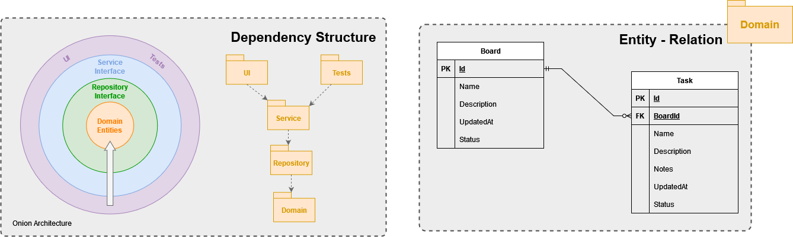

<div align="center">
    <h1 align="center"> My Kanban</h1>
    <strong>Software Engineering Experiment - Practical Knowledge Integralization</strong><br/>
    Pontificial Catholic University of Minas Gerais - PUC Minas<br/>
    Post Graduation - Software Engineering Specialization<br/>
    2023<br/>
    <br/>
    <a href="https://github.com/rochajario/my-kanban-asp.net/actions/workflows/Build_And_Test.yml">
        
    </a>
</div>

<h2>Summary</h2>
<ol>
    <li>
        <a href="#contextualization">Contextualization</a>
    </li>
    <li>
        <a href="#running">Running the Application</a>
    </li>
    <li>
        <a href="#system-specification">System Specification</a>
    </li>
    <li>
        <a href="#architecture-proposal">Architecture Proposal</a>
    </li>
</ol>


<h2>Contextualization</h2>
<div id="contextualization">
    <p>
        The Kanban board is a tool for workflow visualization, designed to help you bring clarity to your work process and enhance efficiency by limiting work in progress. 
        With this new level of transparency, you will quickly identify problematic work stages, and by improving those, your team will soon work more efficiently. 
    </p>
</div>

<h2 id="running">Running the Application</h2>

> Running locally with predefined settings:
```
> BUILD & RUN:
docker compose -f ./compose.local.yml up

> DESTROY & CLEAN:
docker compose -f ./compose.local.yml down
```
> Running in production environments:
1. Ensure that you have a MySQL or a MariaDB with version 8.0.31 configured and accessible by the environment in wich the service will be deployed;
2. Use the <a href="./database/migrations/init.sql">init.sql</a> script to initialize a new database schema;
3. Ensure that the target environment has a variable `CONNECTION_STRING` with the following sintax:
```
server=server_address;user=database_user;password=user_password;database=database_schema
```
4. Run the application <a href="./my-kanban/Dockerfile">Dockerfile</a> with the command docker run


<h2>System Specification</h2>
<div align="center" id="system-specification">
    <table>
        <tr>
            <th>Id</th>
            <th>Description</th>
            <th>System Domain</th>
        </tr>
        <tr>
            <th colspan=3>Functional Requirements</th>
        </tr>
        <tr>
            <td>FR01</td>
            <td align="left">When created, a Board should be given an 'Active' status</td>
            <td>Board Management</td>
        </tr>
        <tr>
            <td>FR02</td>
            <td align="left">An active Board should allow the user finishing all children Tasks at once;</td>
            <td>Board Management</td>
        </tr>
        <tr>
            <td>FR03</td>
            <td align="left">When an active Board is deleted, all children Tasks are deleted also;</td>
            <td>Board Management</td>
        </tr>
        <tr>
            <td>FR04</td>
            <td align="left">
                When a Board receives an 'Inactive' status:
                <ol>
                    <li>Children Tasks can't be changed in any way;</li>
                    <li>The Board itself can't be deleted.</li>
                </ol>
            </td>
            <td>Board Management</td>
        </tr>
        <tr>
            <td>FR05</td>
            <td align="left">Tasks must be related to a single board, meaning that they belong to a specific context;</td>
            <td>Task Management</td>
        </tr>
        <tr>
            <td>FR06</td>
            <td align="left">When created, tasks must be given a status of "New Task", meaning that it still waits for an interaction;</td>
            <td>Task Management</td>
        </tr>
        <tr>
            <td>FR07</td>
            <td align="left">Each and every interaction in tasks must change it's 'lastUpdate' field;</td>
            <td>Task Management</td>
        </tr>
        <tr>
            <td>FR08</td>
            <td align="left">Tasks waiting to be done and ongoing tasks should allow adding comments;</td>
            <td>Task Management</td>
        </tr>
        <tr>
            <td>FR09</td>
            <td align="left">Finished tasks should not allow adding comments;</td>
            <td>Task Management</td>
        </tr>
        <tr>
            <td>FR10</td>
            <td align="left">
                Tasks can be Finished in two ways:
                <ol>
                    <li>Canceled;</li>
                    <li>Completed.</li>
                </ol>
            </td>
            <td>Task Management</td>
        </tr>
        <tr>
            <th colspan=3>Non-Functional Requirements</th>
        </tr>
        <tr>
            <td>NFR01</td>
            <td align="left">App must be optimed to work in small screens (mobile devices);</td>
            <td>User Experience</td>
        </tr>
        <tr>
            <td>NFR02</td>
            <td align="left">App data must be persisted in a free Relational database;</td>
            <td>Implementation</td>
        </tr>
        <tr>
            <td>NFR03</td>
            <td align="left">System must be built using Onion Architecture in order to set a standard of maintanence and growth overtime.</td>
            <td>Implementation</td>
        </tr>
    </table>
    <table>
        <tr>
            <th colspan=2>Reference</th>
        </tr>
        <tr>
            <th>Label</th>
            <th>Description</th>
        </tr>
        <tr>
            <td>FR</td>
            <td>Function Requirement</td>
        </tr>
        <tr>
            <td>NFR</td>
            <td>Non-Function Requirement</td>
        </tr>
    </table>
</div>

<h2>Architecture Proposal</h2>
<div id="architecture-proposal">
    <p align="center">
        <br/>
        <label align="center" for="ermodel">Image 1: Dependency Structure and Intended entities and relations</label>
    </p>
    <p align="center">
        <br/>
        <label align="center" for="mockup">Image 2: Intended navigation scheme with interactions</label>
    </p>
</div>